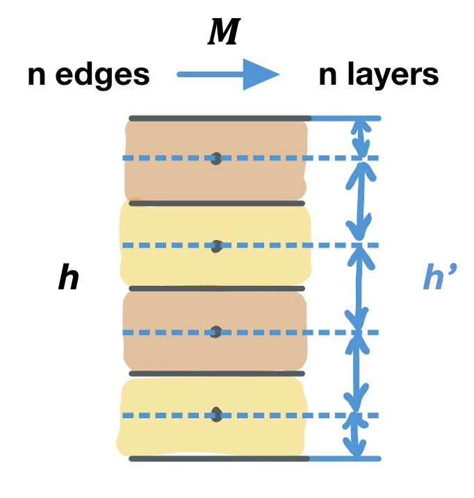

# General Observation Operator for Python (GOOPy)

Mass-conserving vertical interpolation and satellite observation operator for inclusion in GCPy. 

- Inputs: nobs x nedges for 1) satellite observations and 2) corresponding GEOS-Chem columns (requires GEOS-Chem LevelEdgeDiags and SpeciesConc outputs).
- Outputs: GEOS-Chem concentrations interpolated to the satellite layer centers (nobs x nlayers) or satellite layer edges (nobs x nedges)
- The code is parallelized so it is reasonably fast in Python. 

Discussed in this issue for GCPy: https://github.com/geoschem/gcpy/issues/242

## Installing GOOPy

- GOOPy is currently just a set of python code you can clone to your laptop - it's not pip-installable (but we plan to add this soon!)
- Therefore, the easiest way to get the dependencies is to use conda. 
- Create a new conda environment with `conda create -n goopyenv` (or install the following to your existing conda environment):
     - `conda install xarray netcdf4 h5py pyyaml dask`
- Clone GOOPy to your laptop:
     - `git clone git@github.com:pennelise/GOOPy.git`

## Using GOOPy

- Modify the directories and filenames in `config.yaml` under `LOCAL_SETTINGS` to match your satellite and model directories and filenames. 
- Navigate to your GOOPy folder (e.g. `cd ~/GOOPy/`)
- While inside your GOOPy folder, run:
     - `conda activate goopyenv`
     - `python main.py`

##  Configuration file
 This file describes the structure of the satellite or model files used as inputs for the 
 satellite operator. 

 ### Local Settings:
   - PARSER: A string corresponding to the name of a parser defined in
        config.py below LOCAL_SETTINGS. If new satellites are added, new parsers need to be written.
   - Directories and file name formats for satellites and model files. 

 ### Satellite files:
 
 The description of the satellite files requires the following fields to be defined:
   - AVERAGING_KERNEL_USES_CENTERS_OR_EDGES: A string with value 
        'centers' or 'edges' that corresponds to whether the satellite averaging
        kernel values are measured at the pressure centers or edges of the vertical
        grid.
   -  DATA_FIELDS: These fields all define the variable names in the netCDF file for your satellite. 
        name in the satellite file netcdfs.
      - N_OBS: The observation dimension (number of observations)
      - N_EDGES: The dimension containing the vertical level edges
      - N_CENTERS: The dimension containing the vertical level centers
      - Other variable values are as described by the yaml fields.

### Model files:

These should not change much between GEOS-Chem files, except for CONC_AT_PRESSURE_CENTERS, which is different for CO2 and CH4. 
 
 The description of the model files requires the following fields to be defined:
   - LEVEL_EDGE_FILE_FORMAT: A regex string giving the format of the level edge 
        file names
   - PRESSURE_EDGES: A string corresponding to the netcdf variable containing
        the pressure edges
   - CONC_AT_PRESSURE_CENTERS: A string corresponding to the netcdf variable containing the 
        methane concentrations at the center of each pressure level
   - LATITUDE, LONGITUDE, TIME, LEV, and ILEV: Strings corresponding to the netcdf dimensions
        for each of the corresponding quantities

## Description of method for mass-conserving vertical interpolation 

We follow the method described in [Keppens et al. (2019)](https://doi.org/10.5194/amt-12-4379-2019), which describes a mass-conserving interpolation function in eq. 14: 

$$ W' = M_{out}^* W M_{in} $$

Where $M_{in}$ converts from concentrations at pressure **centers** on the model profile to partial columns on the model profile, $M_{out}$ converts from partial columns on the satellite profile to concetrations at pressure edges or pressure centers on the satellite profile, and W is the interpolation matrix defined by eq. 13:

$$ W(i,j) = \frac{1}{\Delta p_{in,j}}(min(p_{out,i}^U, p_{in,j}^U) - max(p_{out,i}^L, p_{in,j}^L)) $$ 

Eq. 14 can be used to interpolate to both pressure edges or pressure centers depending on the choice of $M^*_{out}$. 

We define $M_{out}$, which transforms from pressure centers (or edges) to partial columns, and then take the inverse $M^*_{out}$ to transform from partial columns to pressure centers (or edges). 

To transform from N-1 pressure centers to partial columns, $M_{out}$ is just the pressure difference for each layer, and has dimension (N-1)x(N-1). 

### What if the averaging kernel is defined on pressure edges? 

In the case of some satellite products (such as GOSAT) where the averaging kernel is defined on pressure edges, we now must interpolate this set of N-1 partial columns to N pressure edges. To avoid an underconstrained solution, we add an additional partial column by transforming to partial columns defined *between layers*. Instead of using the original satellite grid $h$, we instead use one that we refer to as $h'$. The transformation is described by eq. 11 (Keppens et al., 2019):

$$ h' = 
\begin{bmatrix}
     1 &  0 &  0 &  0 \\
    .5 & .5 &  0 &  0 \\
     0 & \ldots & \ldots & 0 \\
     0 &  0 & .5 & .5 \\
     0 &  0 &  0 &  1  
\end{bmatrix} h
\ $$

We also illustrate the transformation from $h$ to $h'$ here: 

This now allows us to use $M_{out}$ with dimension NxN, which is invertible. 

### Assumptions:
   - Assumes concentration varies linearly with pressure *within* each layer.
   - The concentrations 1/4 layer from your top and bottom level
      is mapped to the concentation at the top and bottom levels.

      This is unlikely to matter at the top of the atmopshere because
      there is very little mass. If the concentrations in
      your bottom level + second to bottom level are very different,
      this could cause a loss in mass. For methane, this does
              not happen in practice.
